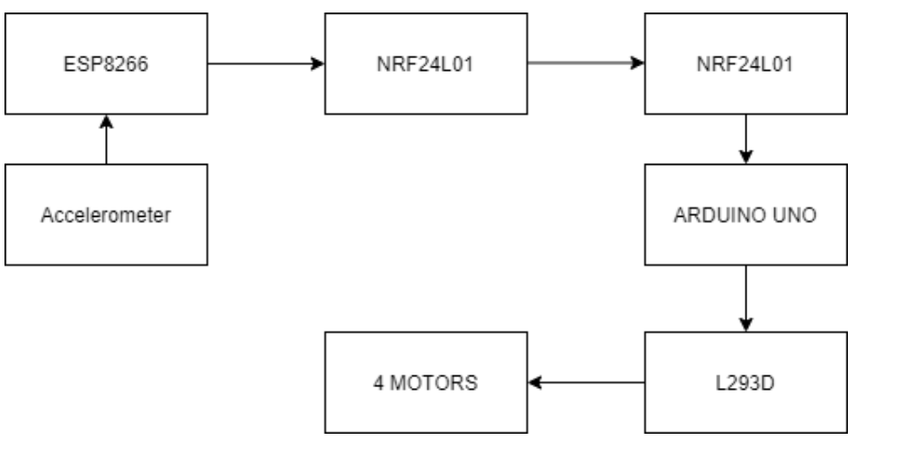
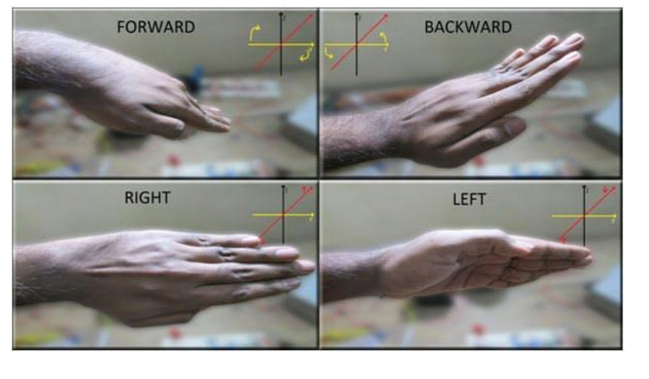
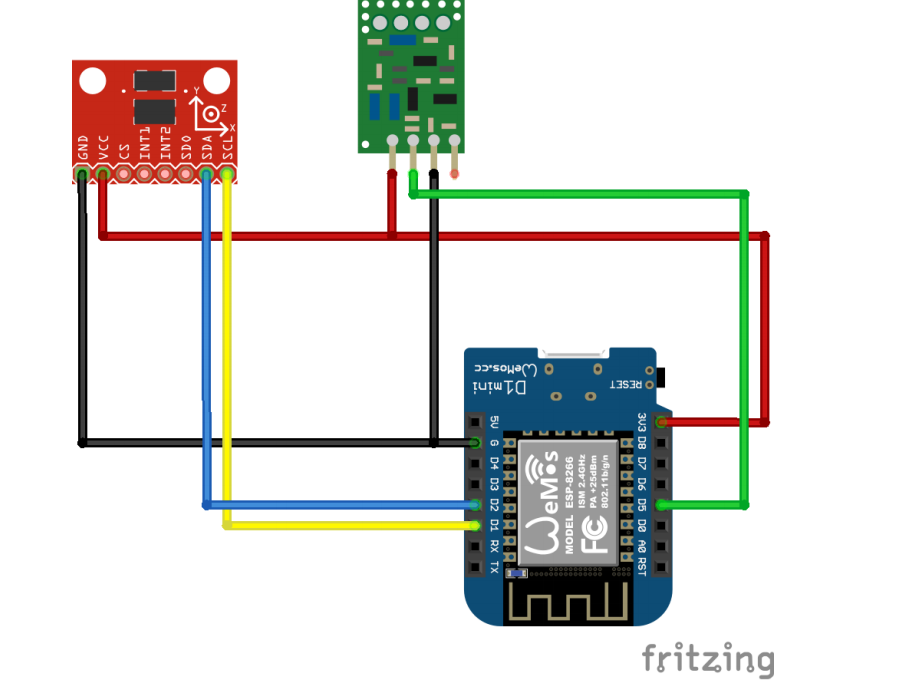
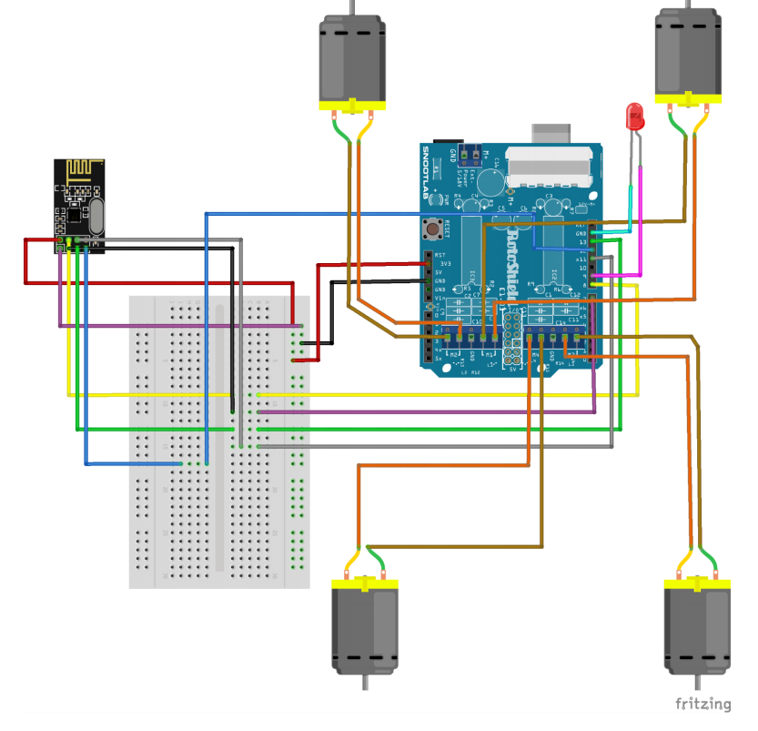
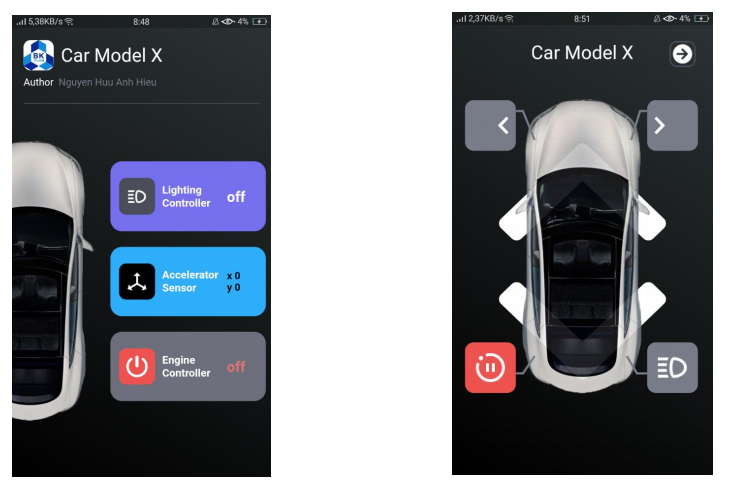
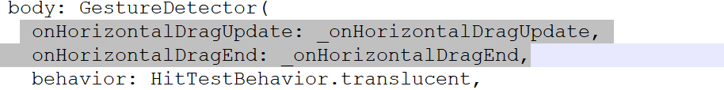
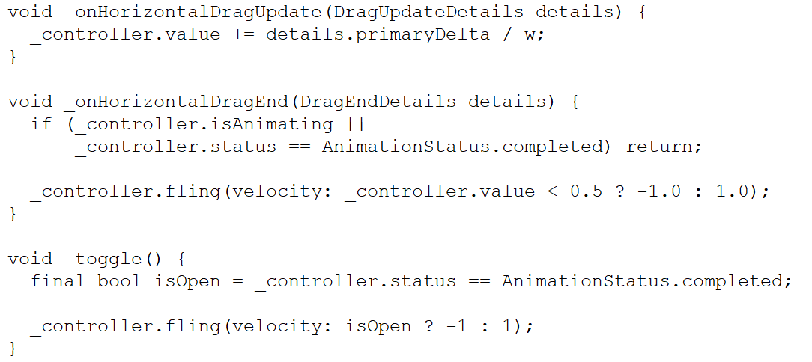
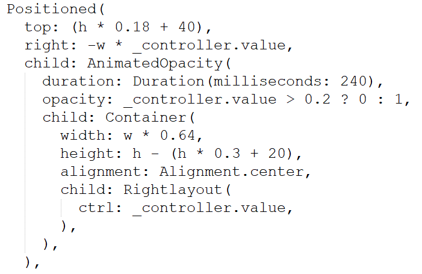
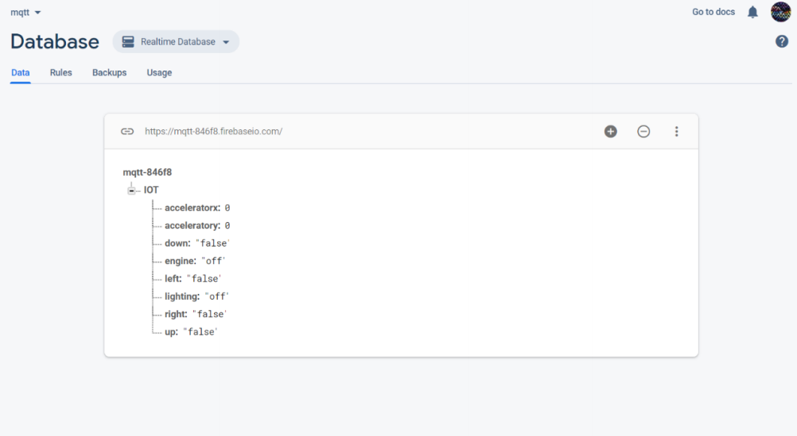

[![LinkedIn][linkedin-shield]][linkedin-url]

  <h3 align="center">IOT Hand Gestrure Controlled with Arduino, Flutter and Firebase</h3>
  

   IOT Hand gestrure controlled in the IOT fullstack project in that i implement three main aspect of IOT project include hardware implement - Esp8266 and Arduino, software implement - Flutter App and server implement - Firebase Realtime database
  

## Demo 

for more video in direction folder **"demo video"**

  
<h2 style="display: inline-block">Table of Contents</h2>

  <ol>
    <li><a href="#about-the-project">About The Project</a></li>
	<li><a href="#project-material">Project Material</a></li>
	<li><a href="#project-material">Block Diagram</a></li>
	<li><a href="#hardware-implement">Hardware Implement</a></li>
	<li><a href="#software-implement">Software Implement</a></li>
	<li><a href="#server-implement">Server Implement</a></li>
	<li><a href="#contact">Contact</a></li>
  </ol>

## About The Project

Some of the most commonly used control systems are voice recognition, tactile or touch controlled and motion controlled. One of the frequently implemented motion-controlled-robot is a Hand Gesture Controlled Robot. In this project, a hand gesture-controlled robot is developed using ADXL345 accelerometer, which is a 3-axis Accelerometer and 3-axis Gyroscope sensor and the controller part is Arduino UNO and ESP 8266. Instead of using a remote control with buttons or a joystick, the gestures of the hand are used to control the motion of the robot. The project is based on wireless communication, where the data from the hand gestures is transmitted to the robot over RF link (RF Transmitter – Receiver pair). The project is divided into transmitter and receiver section. The circuit diagram and components are explained separately for both transmitter and receiver sections. So I decide to make the IOT project with controlled robot by hand and tracking it in app using IOT server

## Project Material

In this project, material of this is a group of devices above:
* Transmitter
	* ESP8266
	* ADXL345 accelerometer
	* 433 MHz RF transmitter
	* Breadboard

* Receiver and Robot
	* Arduino Uno
	* NRF24L01
	* L293D motor driver IC
	* Chassis and wheels
	* 4 DC motors
	* Breadboard

## Block Diagram

## Hardware Implement

In this project, Hardware implement, i decide it into 2 main part, trasimitter and reciever all of them had be implement in Arduino language (Arduino uno and ESP8266).

* Transmitter

Due to tilt of hand, the X and/or Y axis' angle with vertical changes and hence
a component of 'g' acceleration acts upon them as well which can be measured and thus indicates the orientation of the hand. The ADXL345 can measure up to 3g of acceleration and is interfaced with Arduino by connecting it' s axis pins to Analog pins of Arduino. The accelerometer outputs voltage values proportional to acceleration The function of RF module is simple: to transmit command data from wrist Arduino Nano to the motor controlling Arduino Uno. The RF module uses Radio waves at 433hz frequency and thus the name RF-433. They use Amplitude Modulation to send data, but not getting into much technicalities and keeping things simple, they will be used to transmit command to the robot, that is: move forward, backward, right or left. And in case of no data, stand still. They work well up to 10 meters range.

Code for Transmitter in direction **"hardwareimplement/transit.ino"** that from C language in Arduino IDE

* Receiver:
The receiver circuit is completely similar to the transmitter circuit as shown, but instead of data pins going as output from Arduino, in this case they will be read as inputs to take in the command for Arduino Uno and run the motors as required:

Code for Receiver in direction **"hardwareimplement/receiver.ino"** that from C language in Arduino IDE

## Software Implement

In this implement, i using Flutter to create a app for tracking the motion of car by getting the data from server Firebase Realtime database. the name of Flutter app i named by "CarSurvey". Reason why I using Flutter is that easy language (Dark) to create a good UI for customer, Flutter has a huge support for database ( I want to make a IOT application in that IOT architecture Sensor is sensor in Car and node sensor, for gateway cwe using ESP8266 with wifi connection, for Cloud server we using Firebase and for mobile app we using flutter.

in CarSurvey the main TeslaCar statefull widget will be home widget under materialapp in TeslaCar widget i using the GestureDetector for main body in that onHorizontalDragUpdate onHorizontalDragEnd will be the animation trans between 2 page above.

in that GestureDetector i using the controller to control animation with some change value to create the flip animation for TeslaCar

the other layout like right layout with showing data from Firebase put them into the Position to with width outof screen to make them look like in the new page but it not

Full Dart code Flutter in direction folder **"CarSurvey"**

For Function of CarSurvey:
* Tracking motion of car (Move forward. Move backward, Move left, Move right) with data come from sensor node
* Control Lighting led in car using Firebase to controller node
* Start engine of car sam of control lighting with rule we can do anything in start state
* View Accelerator x y from node using streambuilder from flutter to take a
number of accelerations in sensor node

## Server Implement

In this project i using Firebase Realtime database to be the server like MQTT to manager any data from sensor node - esp8266.Connection between ESP8266 gateway to cloud server Firebase: I using lib for esp8266 to read json query from Realtime database. Image below is a page of Data we store and using in this application. Connection between Mobile app to cloud server Firebase: I using the same tech above.

## Contact

Hieu Nguyen - [Linkedin](https://www.linkedin.com/in/hieunguyen-dev/)

Linkedin: https://www.linkedin.com/in/hieunguyen-dev/

Email: hnhieu979@gmail.com

Phone: 0927931496

Facebook: https://www.facebook.com/hieu.nguyenmixed

Project Link: [https://github.com/HieuNguyenHuu/IOT_HandGestrureControlled_Flutter](https://github.com/HieuNguyenHuu/IOT_HandGestrureControlled_Flutter)

[linkedin-shield]: https://img.shields.io/badge/-LinkedIn-black.svg?style=for-the-badge&logo=linkedin&colorB=555
[linkedin-url]: https://www.linkedin.com/in/hieunguyen-dev/

